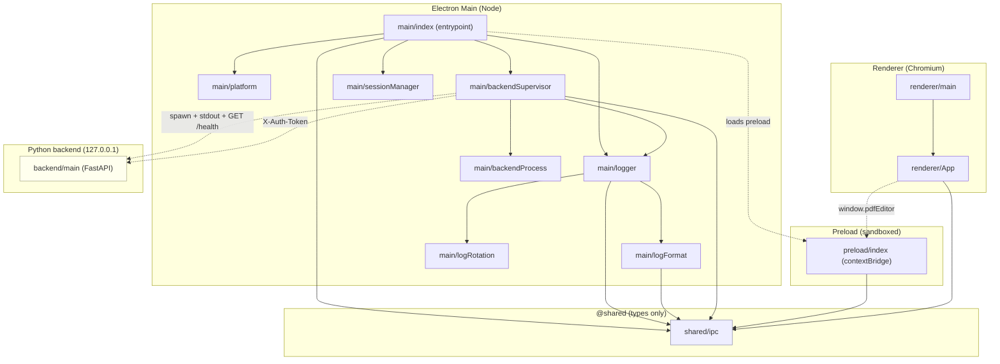
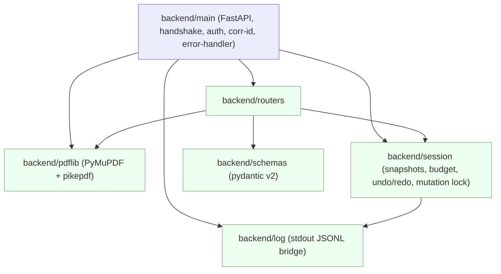

# Codegraph (generated view)

Mermaid view of [`codegraph.json`](./codegraph.json) — the cross-step working instrument
(Spec Section 0.2). The JSON is the source of truth; this file is derived.

Layering rule enforced: the **renderer never references backend/Node code** — it talks only to
the typed `contextBridge` (`window.pdfEditor`) and imports `@shared` types. No cycles.

## Step 1 + Step 2

## Contracts

| id | request | response | producer | consumers | step |
|---|---|---|---|---|---|
| IPC app:get-version | void | string | main/index | preload/index | 1 |
| IPC app:get-platform | void | PlatformInfo | main/index | preload/index | 1 |
| IPC log:write | RendererLogInput | void | preload/index | main/index | 1 |
| Bridge window.pdfEditor | PdfEditorBridge | — | preload/index | renderer/App | 1 |
| stdout listening handshake | void | `{event:'listening',port,pid,protocolVersion}` | backend/main | main/backendSupervisor | 2 |
| stdout log bridge | void | LogEntry (JSONL) | backend/main | backendSupervisor→logger | 2 |
| GET /health (token-exempt) | void | `{status,version,protocolVersion,pid}` | backend/main | backendSupervisor | 2 |
| X-Auth-Token gate | header | 401 on missing/mismatch (non-/health) | backendSupervisor | backend/main | 2 |
| IPC backend:get-status | void | BackendStatusSnapshot | main/index | preload/index | 2 |
| IPC backend:status (push) | void | BackendStatusSnapshot | main/index | renderer/App | 2 |

## Step 3 — Backend core

| contract | request | response (camelCase) | producer | step |
|---|---|---|---|---|
| POST /document/open | OpenRequest | OpenResult \| PdfError | backend/routers | 3 |
| GET /document/state | void | DocumentState | backend/routers | 3 |
| GET /document/pages | void | {pages:[PageInfo]} | backend/routers | 3 |
| GET/POST /document/metadata | — / MetadataRequest | Metadata (undoable on POST) | backend/routers | 3 |
| POST /pages/rotate·delete·reorder·merge | Rotate/Delete/Reorder/Merge | {…} undoable · bad_page | backend/routers | 3 |
| POST /document/encrypt | EncryptRequest | {encrypted,algorithm} irreversible | backend/routers | 3 |
| POST /document/save | SaveRequest | {saved,path,encrypted} · write_denied | backend/routers | 3 |
| POST /document/undo·redo | void | {canUndo,canRedo,undoDepth,pageCount} | backend/routers | 3 |
| PdfError envelope | exception | {error,message,correlationId} @ status | backend/routers | 3 |

Verified against installed libs: **PyMuPDF 1.28.2** (`fitz.open` has *no* `password` kwarg → `authenticate()`;
return value is a permission bitmask, owner = bit 4, not 0/1/2; `PDF_ENCRYPT_NONE=1`, `PDF_ENCRYPT_KEEP=0`)
and **pikepdf 10.13** (`Encryption(owner,user,R=6)`, `docinfo['/Title']`, `PasswordError`).

## Step 4 — Backend crypto + coordinate contract

`backend/crypto_ops.py` (pyHanko sign/verify + PyMuPDF stamping) is imported by `backend/routers`;
`renderer/pdfCoords.ts` is a pure frontend util consumed by the (Step 8) overlay and Step 9/10 stamp & VLM features. The renderer imports no Node/backend code.

| contract | request | response | producer | step |
|---|---|---|---|---|
| POST /document/sign | SignRequest | `{signed,field,page}` irreversible · signature_error/missing_certificate/bad_page | backend/routers | 4 |
| GET /document/signatures | void | `{signatures:[{field,intact,valid,trusted,mdAlgorithm,signerCn}]}` | backend/routers | 4 |
| POST /document/stamp | StampRequest | `{page,addedImages,imagesOnPage}` undoable · bad_image/bad_page | backend/routers | 4 |
| coord canvas→PDF | (cssX,cssY,page,scale,rotation) | PdfPoint / PdfRect (bottom-left) | renderer/pdfCoords | 4 |

Verified against installed libs: **pyHanko 0.37.0** — `sign_pdf(pdf_out=IncrementalPdfFileWriter(handle), signature_meta=PdfSignatureMetadata(field_name=X), signer=SimpleSigner.load_pkcs12(p12, passphrase=bytes), new_field_spec=SigFieldSpec(sig_field_name=X, on_page, box=(x1,y1,x2,y2)), output=handle)`; **`field_name` must equal `sig_field_name`**; verification via `PdfFileReader(handle).embedded_signatures` + `validate_pdf_signature(s, skip_diff=True)` → status `.intact/.valid/.trusted/.md_algorithm`, field via `.field_name`; tamper surfaces as `PdfReadError` (caught). **pdfjs-dist 4.10.38** — `pdfCoords.ts` ports the `PageViewport` transform matrix 1:1; `convertToPdfPoint = applyInverseTransform([x,y], transform)`; inverse round-trip verified across zoom×rotation.

## Step 5 — Document understanding (context layer)

`backend/context/*` (base·basic·docling·service·router) + the `backend/docling_worker` sidecar entrypoint. `backend/main` mounts `context/router` and owns a `ContextService` on `app.state`; `service` selects a provider (the only `if docling` branch) and launches the `BasicProvider` conversion in a **separate process** (`multiprocessing.spawn`, target `basic_worker_main`) or, for Docling, delegates to `DoclingProvider`, which spawns the sidecar as its own process group. `docling_worker` is the ONLY module importing `docling` and is never imported by the backend. The `renderer/aiPanel → context/router` edge is the (Step 10) HTTP seam; the AI gateway (Step 6) reads the JSONL from disk directly and never goes through the frontend (5.3.1).

| contract | request | response | producer | step |
|---|---|---|---|---|
| GET /context/providers | void | `{providers, docling, protocolVersion}` | context/router | 5 |
| POST /context/analyze | `{provider?}` | `{contextId,status,provider,pageCount,fromCache}` · docling_unavailable | context/router | 5 |
| GET /context/{id}/manifest | void | manifest / progress | context/router | 5 |
| GET /context/{id}/pages | from,to | `{elements:[{page,bbox,text,heading,level,...}]}` | context/router | 5 |
| GET /context/{id}/regions | page | `{page,regions}` | context/router | 5 |
| POST /context/{id}/cancel | void | `{status:cancelled}` | context/router | 5 |
| GET /context/{id}/stream | void | SSE progress | context/router | 5 |
| docling sidecar protocol | `--version` \| `worker IN OUTDIR` | JSONL stdout + disk JSONL/manifest | docling_worker | 5 |

Verified against installed libs: **PyMuPDF 1.28.2** `get_text("dict")` → `page{width,height,blocks}`, `block{type(number),bbox,lines}` (type 1 = image), `line{spans,bbox}`, `span{text,size,flags,font,bbox}`; bold = `flags & 16`; `page.rotation ∈ {0,90,180,270}`. Cache key = (SHA‑256 of work copy, provider) → provider switch or content change yields a new `contextId` (auto‑invalidate). Docling detection = file‑existence + `--version` handshake; a `protocolVersion` mismatch disables the provider. The `multiprocessing.freeze_support()` guard added in `main` covers the frozen worker spawn (Section 5.3/Step 12).

## Step 6 — AI gateway

`backend/ai/*` (config·secrets·tokeniser·retrieval·client·logfilter·gateway·router). `backend/main` mounts `ai/router` and owns `app.state.ai_config` (single‑writer `AiConfigStore`, path resolved lazily → testable), `app.state.secrets` (`SecretsManager`) and `app.state.ai_streams`. The gateway reads the provider JSONL **directly from disk** (`context/base`), never via the frontend. The `renderer/aiPanel → ai/router` edge is the (Step 10) HTTP seam.

| contract | request | response | producer | step |
|---|---|---|---|---|
| GET /config/ai | void | effective view + keyStatus + version | ai/router | 6 |
| PUT /config/ai | AiConfig | effective view · config_invalid | ai/router | 6 |
| POST /config/ai/test | `{section,candidate{baseUrl}}` | `{ok,models,latencyMs,error?}` (no persist) | ai/router | 6 |
| POST /config/ai/key · DELETE | `{section,key,mode?}` | `{stored,source}` (never echoes) · keyring_unavailable | ai/router | 6 |
| GET /config/ai/key-status | void | `{mode,keys}` | ai/router | 6 |
| GET /ai/models | section | `{ok,models,latencyMs,error?}` | ai/router | 6 |
| POST /ai/estimate | `{contextId?,question,page?,scope?}` | tokens, pagesAffected, nonLocal, host, requireConfirm | ai/router | 6 |
| POST /ai/chat | AiChatRequest | SSE `<meta\|token\|done\|error\|cancelled>` | ai/router | 6 |
| POST /ai/chat/cancel | `{streamId}` | cancelling/not_found | ai/router | 6 |

Verified against installed libs: **openai 3.13.0** = modern client — `AsyncOpenAI(base_url,api_key)`, `chat.completions.create(...,stream=True)`, `models.list()`, chunk `.choices[].delta.content`, errors `APITimeoutError/AuthenticationError/NotFoundError/APIConnectionError/BadRequestError` (context‑overflow detected from the 400 message). Under `respx` the SDK must be given an injected `http_client` (`_HTTP_CLIENT_FACTORY`) — plain global patch is bypassed by the SDK's own transport. **rank_bm25 0.2.2** `BM25Okapi(corpus).get_scores(q)`. **argon2** low‑level `hash_secret_raw(..., Type.ID)` for the encrypted‑file KDF (not the password hasher). **cryptography AESGCM** envelope = version‖salt(16)‖nonce(12)‖ct+tag, fresh nonce/salt per write. `is_local` gate + `confirmBeforeSend` for non‑local hosts. Logging emits only metadata (model, durationMs, outputTokens); prompts gated by `privacy.logPrompts`; keys redacted by `ai/logfilter`.

## Step 7 — Frontend foundation

`renderer/{store/useAppStore, lib/apiClient, lib/apiTypes, i18n, components/Toast}`. `App` bootet das Fundament: `getBackendAuth` (Bridge) → `initApiClient` → `refreshDocumentState`. `useAppStore` (zustand v5 + immer, curried `create<T>()(immer(...))`) hält **nur Command‑Metadaten** (Undo/Redo nach Section 3), `mutationLock`, Toasts, Backend‑Status. `apiClient` setzt `X-Auth-Token` + `X-Correlation-Id`, wiederholt nur idempotente GETs (Backoff 200/600), bildet Fehler auf `ApiError{code,correlationId,status}`; SSE via `fetch`+`AbortController`. **Layering:** Renderer → nur `preload/bridge` + getypter Client → Backend; keine direkten Backend‑Imports, Cloud‑Key nie im Renderer.

| contract | request | response | producer | consumer | step |
|---|---|---|---|---|---|
| IPC backend:get-auth | void | `{baseUrl,token} | null` | main/index | apiClient | 7 |
| GET /document/state | void | DocumentState | backend/routers | useAppStore | 3→7 |
| POST /document/{undo,redo} | void | DocumentState | backend/routers | useAppStore | 3→7 |

Verified gegen **zustand 5.0.15** (installierte Typen): curried `create<T>()(immer(...))`, `setState(draft=>{…})` (Draft‑Mutation, kein Return), `useShallow` ab `zustand/react/shallow`; **immer 10.2.0**; **axios 1.20.0** Interceptor/Adapter. i18n: ein `t()`/`useT()`, Bundles `de.json`/`en.json` mit **identischem Keysatz** (Parität getestet), Default Systemlocale mit Fallback Deutsch.

## Step 8 — Rendering engine

`renderer/{lib/pdfjs, lib/thumbnailWindow, lib/overlayMath, hooks/usePdfDocument, hooks/usePdfPageRender, components/{PageCanvas,InteractionOverlay,ThumbnailList}}`. Engine liegt bewusst **vor** der UI‑Shell (Sidebar hängt dran): App bindet sie erst in Step 9 ein (`mount (Step 9)`‑Kanten = geplante Consumption, keine Orphans durch Versehen). `usePdfDocument` holt Bytes via `api.getBytes('/document/file')` → `pdfjs.getDocument({data})`; Worker lokal via `?url` gebündelt (kein CDN). `usePdfPageRender` liefert die **exakte** `PageViewport` ans `InteractionOverlay`, das ausschließlich `viewport.convertToPdfPoint` (öffentliche Naht) nutzt — nie einen PDF.js‑Internen Layer. Thumbnail‑Virtualisierung über reine `thumbnailWindow()`.

| contract | request | response | producer | consumer | step |
|---|---|---|---|---|---|
| GET /document/file | void | application/pdf bytes (`no-store`) · `no_document` 409 | backend/routers | usePdfDocument | 8 |

Verified gegen **pdfjs‑dist 4.10.38** (installierte Typen): `getDocument({data,isEvalSupported})`, `page.getViewport({scale,rotation})`, `page.render({canvasContext,viewport,transform})`, `RenderTask.promise`/`.cancel()`, `PageViewport.convertToPdfPoint/convertToViewportPoint`, `GlobalWorkerOptions.workerSrc` (Setter). `?url`‑Worker wird im Build als `assets/pdf.worker.min-<hash>.mjs` emittiert (verifiziert). **Grenze:** echte Canvas‑Rasterisierung in jsdom nicht prüfbar → Build/Type hier, Ende‑zu‑Ende in Step 12 (Playwright). Overlay/Rechteck/Koordinaten kontraktgetestet (`overlayMath` == `pdfCoords`).

## Step 9 — UI shell

`renderer/{store/useUiStore, lib/documents, hooks/usePageSize, components/{TopBar,Sidebar,AppShell,SettingsModal,PasswordModal,MetadataPanel}}` + Dialog‑IPC (`dialog:open-pdf|save-pdf|pick-cert`) in `shared/ipc`/`preload`/`main`. `App` mountet `AppShell` erst bei `backendStatus==='ready'`. `AppShell` hält die pdfjs‑Instanz EINMAL und reicht sie an `PageCanvas` + `ThumbnailList` (kein Doppel‑Load). `lib/documents` ist die einzige Stelle, die Mutationen auslöst (hält `mutationLock`, schreibt Command‑Metadaten, `docVersion++`, Fehler→Toast). Layering hält: alle `renderer → backend`‑Kanten sind *via typed client* oder geplante Step‑10‑Notiz — **kein** direkter Backend‑Import.

Neue Verträge: `POST /document/open|save`, `POST /pages/rotate|delete|reorder|merge`, `GET/POST /document/metadata`, plus IPC‑Dialoge `dialog:open-pdf|save-pdf|pick-cert` (`string|null`). Electron‑`dialog` gegen installierte Electron‑33‑Typen verifiziert (parentlose Overloads, `{canceled,filePaths,filePath}`).

Grenze laut Plan (keine Platzhalter): Drucken deaktiviert (Step 12), „KI‑Vorschlag", KI‑Tab‑Konfig, Signatur‑/Zert‑Modals, Drag‑Reorder → Step 10 — Buttons sichtbar im korrekten deaktivierten Zustand.

## Step 10 — AI surface

`renderer/{lib/aiClient, store/useAiStore, components/AiPanel}` + KI‑Vorschlag in `lib/documents`/`MetadataPanel` + Overlay‑Tool‑Verdrahtung in `AppShell` (`activeTool`/`onRect`). `AiPanel` (Tab 5) spricht nur `aiClient` → `apiClient`/`sseStream`; `useAiStore` orchestriert Chat (Streaming, Stopp via `AbortController` + `POST /ai/chat/cancel`), Quellen‑Chips (`jumpToSource` → `AppStore.currentPage`), und die VLM‑Region über das Step‑8‑Overlay (`viewport.convertToPdfPoint`, PDF‑User‑Space).

**Vertrags‑Korrektur (Codegraph‑Zweck):** Die `AiChatEvent`‑Union riet vorher Felder (`truncated`/`withoutSource`). Gegen `backend/ai/router.py` (Step 6) korrigiert auf den echten SSE‑Payload (`{token}` / `{event:'done'|'error'|'cancelled'}` / meta `streamId`); `apiClient.mapAiEvent` normalisiert an EINER Stelle. `api.put` ergänzt (`PUT /config/ai`). Layering: alle `renderer → backend`‑Kanten sind *via typed client*; Verifikationslauf bestätigt (keine Direktaufrufe). Kein API‑Key im Renderer (`as_client_view` ohne Keys).

Neue Verträge: `GET/PUT /config/ai`, `POST /config/ai/test`, `GET /ai/models`, `POST /ai/estimate`, `POST /ai/chat` (SSE), `POST /ai/chat/cancel` (Consumer `renderer/lib/aiClient` · `renderer/store/useAiStore`).

Grenze laut Plan: volle 5.4‑Aktionsliste + VLM‑Follow‑ups (Kopie/Anmerkung/Notiz, zugeschnittenes Thumbnail) nutzen denselben `/ai/chat`‑Gateway und werden gegen die laufende App in Step 12 endgeprüft; KI schreibt nie automatisch ins PDF.

## Step 11 — Debug-Konsole

`shared/anonymise` · `renderer/{store/useDebugStore, components/DebugPanel, lib/dumpBuilder}` + Main-Seitig: `logger.readTail` + `initLogger(onWrite)`-Live-Spiegel, IPC `log:line`/`log:tail`/`debug:dump-write`/`debug:codegraph-read`. Der Main ist der einzige Log-Leser/-Schreiber (Single-Writer, Section 6); der Renderer erhaelt die Zeilen ueber den `contextBridge`-Push und sieht nie die Datei. `Ctrl+Shift+D` (in `AppShell`) schaltet das Panel; Toast „Details anzeigen" ruft `useDebugStore.openFor(correlationId)` auf (Panel vorbefiltert).

Dump: `dumpBuilder` sammelt Log-Tail (200), `getPlatformInfo`, `GET /debug/versions` (Python/Bibliotheken/Docling via `find_spec`, nie Import), schluesselfreie KI-Konfiguration (`originOnly` streicht Base-URL-Zugangsdaten) und Codegraph-Struktur; `createAnonymiser` ersetzt alle Pfade/Namen durch stabile Tokens. App-State wird kuratiert (keine Pfade/Passwoerter/Zertifikate). Ergebnis: `ai_debug_dump.md` als fertiger LLM-Prompt.

Neue Vertraege: `GET /debug/versions` (Consumer `renderer/lib/dumpBuilder`) + IPC `log:line`/`log:tail`/`debug:dump-write`/`debug:codegraph-read`. Layering bleibt sauber: keine `renderer -> backend`-Direktaufrufe (Verifikation: leere Liste). `useDebugStore` importiert bewusst keine anderen Stores, damit `useAppStore -> useDebugStore` (Toast-Aktion) keinen Zyklus bildet.

## Step 12 — Packaging

Keine neue Renderer‑Schicht, aber der Paketier‑Pfad wird an die laufende Architektur angedockt:

- `main/backendSupervisor` (`frozenBinary`) und `main/index.resolveBackend` starten paketiert die PyInstaller‑**onedir**‑Executable (`resources/backend/pdf-editor-backend/…`) statt Interpreter+`main.py`; der stdout‑Handshake bleibt identisch (Verifikation real: `{"event":"listening",…,"protocolVersion":"1.0"}` + `/health` + `/debug/versions` gegen den eingefrorenen Binary).
- `main/platform.planChromiumLaunch` (Wayland/X11, respektiert `ELECTRON_OZONE_PLATFORM_HINT`) bleibt die einzige Flag‑Quelle; der `build/linux/pdf-editor`‑Wrapper wendet dieselbe Regel vor dem Exec an (Absicherung).
- Init‑File‑Kontrakt `app:get-initial-file` (`%f`/argv → `AppShell` → `openDocument`) für Desktop‑Assoziation + Smoke‑Test.
- `renderer/components/ThumbnailList` an `documents.rotatePage/deletePage` angeschlossen (Section‑4B‑Lücke geschlossen): Hover‑Drehen/Löschen erben `mutationLock`/Read‑only/Undo.

Artefakte (außerhalb des Codegraph als Baukonfiguration): `backend/backend.spec` (onedir, `console=True`), `backend/docling_worker.spec` (separates onedir), `electron-builder.yml` (rpm‑Target, `extraResources`), `build/linux/pdf-editor{,.desktop,.spec}` (Wrapper + `.desktop` + RPM mit **separatem** Unterpaket `pdf-editor-docling`), `scripts/build.sh` (Paketierung), `scripts/build-pipeline.sh` (R72‑Einstiegspunkt: Gates → Tests → Build → RPM → Release‑Manifest → optionale Installation; siehe `docs/build-pipeline.md`), `playwright.config.ts` + `tests/e2e/smoke.spec.ts`.

Nachweis ohne GUI: echter PyInstaller‑onedir‑Build (217 MB) startet + bedient `/health` und `/debug/versions` (401 ohne Token, `doclingAvailable:false`); `rpmbuild` (Stub‑Inhalt) erzeugt Basis‑RPM **ohne** Docling‑Dateien und **ohne** Docling‑Abhängigkeit plus separates `pdf-editor-docling`‑Paket. `rpmspec -P` fehlerfrei.

## Checks

- Orphans: none — every module is imported or an entrypoint; `backend/main` is spawned by `main/backendSupervisor`.
- Cycles: none.
- Layering: renderer → `@shared` + bridge only; **no** Node/backend imports; the **auth token never crosses** the preload boundary (only `BackendStatusSnapshot` without it). OK.
- Broken contracts: none. Health-exemption of `/health` matches the readiness poll; auth gate matches the token env.
