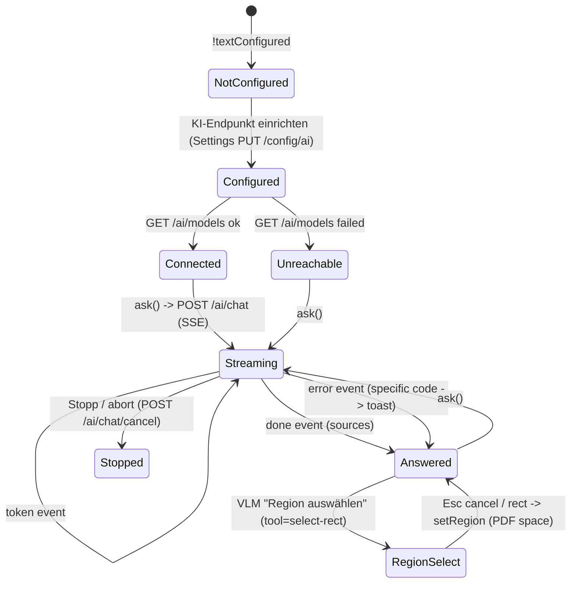

# UI Feature — AI surface (Tab 5 chat, source chips, VLM region)

Product language: **de** labels, instruction prose English. Scope: the AI assistant tab — endpoint status, streaming chat with stop, source chips that jump the canvas, cost estimate + non‑local confirm, the Docling‑gated action list, and the canvas selection box for VLM features. All AI runs in the backend; the renderer only talks to the typed client (`aiClient`).

## Screen / state diagram



Not‑configured is a first‑class state (no error, only an entry hint), per Section 4 Tab 5.

## UI-to-function graph

```mermaid
flowchart LR
    LOAD["AiPanel mount"] --> LC["useAiStore.loadConfig()"]
    LC -->|GET /config/ai| CFG["aiClient.getAiConfig"]
    CFG --> BEA["backend/ai/router"]
    LOAD --> LM["listModels('text')"] -->|GET /ai/models| BEA
    ASK["ask(question)"] --> EST["estimateChat()"] -->|POST /ai/estimate| BEA
    ASK --> SC["streamChat()"] -->|POST /ai/chat SSE| BEA
    SC --> MAP["apiClient.mapAiEvent -> AiChatEvent"] --> RED[("useAiStore.messages / sources")]
    RED --> CHIPS["source chip"] -->|jumpToSource(p)| APP[("AppStore.currentPage")]
    STOP["Stopp"] --> CTRL["AbortController.abort()"] --> CC["cancelChat(streamId)"] --> BEA
    VLM["Region auswählen"] --> TOOL["useAiStore.setTool('select-rect')"]
    TOOL --> OV["InteractionOverlay onRect"] --> REG["setRegion (PDF space)"]
    CIS["MetadataPanel KI-Vorschlag"] --> SM["suggestMetadata()"] --> SC
```

## Action table

| Action ID | Screen and visible label | Event and enabled condition | Handler / route / command source | Service or effect source | Pending, success, error, cancel behavior | Acceptance evidence |
|---|---|---|---|---|---|---|
| `A_AI_SEND` | Tab5 — Send (`Send`) | `draft.trim()` non‑empty and not streaming | `AiPanel.send` → `useAiStore.ask` [`AiPanel.tsx`](../../src/renderer/components/AiPanel.tsx) / [`useAiStore.ts`](../../src/renderer/store/useAiStore.ts) | `POST /ai/estimate` then `POST /ai/chat` SSE [`aiClient.ts`](../../src/renderer/lib/aiClient.ts) | streaming placeholder; tokens append live; `done` sets sources; error → specific toast | `tests/renderer/useAiStore.test.ts` (tokens, sources, error) |
| `A_AI_STOP` | Tab5 — Stopp (`Square`) | while `streaming` | `useAiStore.stop` | `AbortController.abort()` + `POST /ai/chat/cancel` | aborts fetch, marks message not streaming | `tests/renderer/useAiStore.test.ts` (stop → cancelChat with streamId) |
| `A_SOURCE_CHIP` | Tab5 — page chip on an answer | click, when `sources.length > 0` | `jumpToSource(page)` [`useAiStore.ts`](../../src/renderer/store/useAiStore.ts) | `AppStore.setCurrentPage` (canvas jumps) | — | chip rendered only when sources present; wiring tested by store `done.sources` |
| `A_AI_REGION` | Tab5 — „Region auswählen" | `visionConfigured` | `setTool('select-rect')` → `InteractionOverlay` → `onRect` → `setRegion` [`AppShell.tsx`](../../src/renderer/components/AppShell.tsx) | PDF‑user‑space rect via `viewport.convertToPdfPoint` | Esc cancels tool; rect shown with coords + cancel | `tests/renderer/InteractionOverlay.test.tsx` (select‑rect emits PDF rect) |
| `A_META_SUGGEST` | Tab2 — „KI‑Vorschlag" (`Sparkles`) | `docOpen && !readOnly && textConfigured` | `MetadataPanel` → `suggestMetadata()` [`documents.ts`](../../src/renderer/lib/documents.ts) | reuses `POST /ai/chat` (JSON answer) | busy label „Beschäftigt …"; fills form only on valid JSON; else no change | gated on `useAiStore.config.textConfigured` |
| system `S_STREAM_MAP` | chat area | each SSE frame | `apiClient.mapAiEvent` [`apiClient.ts`](../../src/renderer/lib/apiClient.ts) | normalizes `{token}/{event}` → `AiChatEvent` | unknown frames dropped | `tests/renderer/aiClient.test.ts` (7 mapping cases) |

## Verified source symbols

- `AiPanel`, `MetadataPanel` (KI‑Vorschlag) — [`src/renderer/components/`](../../src/renderer/components/)
- `useAiStore` (`ask/stop/loadConfig/setTool/setRegion`, `jumpToSource`) — [`src/renderer/store/useAiStore.ts`](../../src/renderer/store/useAiStore.ts)
- `getAiConfig/streamChat/cancelChat/estimateChat/listModels/isLocalBaseUrl` — [`src/renderer/lib/aiClient.ts`](../../src/renderer/lib/aiClient.ts)
- `mapAiEvent`, `api.put` — [`src/renderer/lib/apiClient.ts`](../../src/renderer/lib/apiClient.ts)

## Validation notes

- Backend contract verified against `backend/ai/router.py` (this repo, Step 6): `POST /ai/chat` streams `event: meta` + `{token}`/`{event:'done'|'error'|'cancelled'}` frames; `GET /config/ai` returns `as_client_view()` (no keys); `POST /ai/chat/cancel {streamId}`; `POST /ai/estimate → {estimatedInputTokens,pagesAffected,nonLocal,host,requireConfirm}`. The `AiChatEvent` union was corrected to this real shape (it previously guessed fields) — that is the codegraph preventing Step‑10 from coding against a wrong signature.
- **No API key ever reaches the renderer** (Section 5.1): `as_client_view` omits keys; the renderer only holds `textConfigured`/`keyStatus`. `AiChatEvent` carries text/sources only.
- No Docling → tables/outline stay disabled with tooltip „Benötigt Docling — nicht installiert"; a permanent „Basis‑Extraktion" badge is shown (Section 5.3 transparency). AI results are proposals only; nothing writes to the PDF without a confirmed command.
- Automated: `vitest` **96** (mapAiEvent ×7, useAiStore ×5 added). `tsc` node+web clean; `electron-vite build` OK.
- **Scope note (honest):** the full 5.4 action list beyond chat (summary/translate/sensitive/outline/tables) and the VLM result follow‑ups (copy / insert annotation / append note, cropped‑region thumbnail) are represented by their affordances here; their dedicated backend actions are exercised through the same `/ai/chat` gateway and are completed against the running app in Step 12. `AI results never modify the PDF automatically` holds everywhere in this slice.
