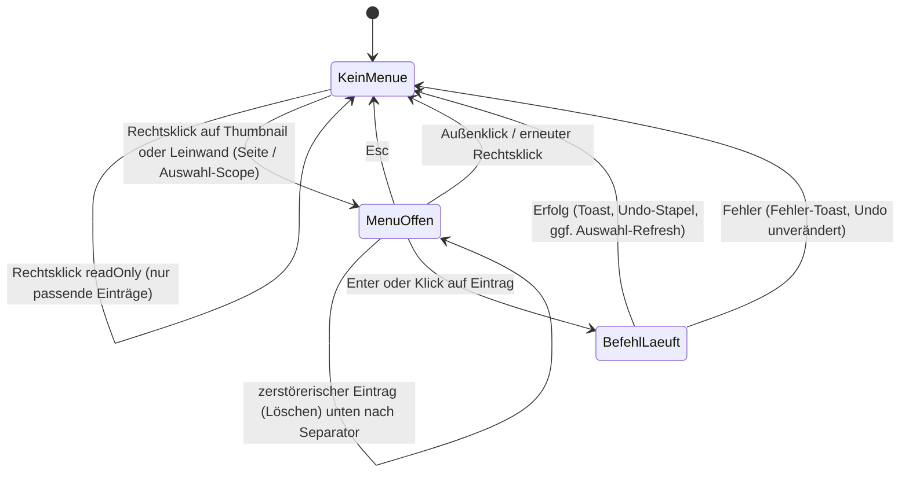
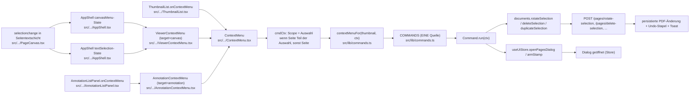

# Kontextmenü (Rechtsklick) — PART 3 §6

**Status:** Thumbnail-, Canvas- **und Annotations-Ziel implementiert und über den echten Rechtsklick
verifiziert** (Canvas: Textauswahl-Aktionen → Seiten-Operationen → Ansicht-Aktionen; Auswahl-
Aktionen inklusive echtem Auswahl-Fänger in `PageCanvas`; Annotation: Eigenschaften/Löschen).
„Antworten" auf Annotationen und das Stempel-Anwenden-Menü sind **proposed**, weil ihre
Registry-Einträge echte Handler brauchen müssen (§2).
Eine Quelle für alle Aktionen ist die Command-Registry `src/renderer/lib/commands.ts`; das Menü rendert
ausschließlich daraus (`contextMenuFor`). Es definiert keine eigene Aktions-Kopie.

Betroffene Quellorte: `src/renderer/components/ContextMenu.tsx` (Menü + Tastatur),
`src/renderer/components/ThumbnailList.tsx` (`onContextMenu` am `thumb-wrap-\${i}`-Umschlag,
Scope-Berechnung `cmdCtx`), `src/renderer/components/PageCanvas.tsx` (`onRequestMenu` am Seitenkasten),
`src/renderer/components/ViewerContextMenu.tsx` + `src/renderer/components/AppShell.tsx`
(Canvas-Menü-Zustand), `src/renderer/components/AnnotationListPanel.tsx` +
`src/renderer/components/AnnotationContextMenu.tsx` (Annotations-Ziel),
`src/renderer/lib/commands.ts` (`COMMANDS`, `contextMenuFor`, `pageScopeLabel` — EINE Scope-Regel).

## 1. Zustandsdiagramm (UI-Zustände / Aktionen)

## 2. Flussdiagramm (Steuerelement → Handler → Domain → persistierter Zustand)

## 3. Aktionstabelle (Steuerelement → verifizierter Quellort + Beleg)

`actionId` = Registry-`id` in `src/renderer/lib/commands.ts` (Label/Icon/Reihenfolge dort definiert).
Belege: `tests/renderer/thumbnailContextMenu.test.tsx` (echter Rechtsklick-Pfad),
`tests/renderer/contextMenu.test.tsx` (Menüregeln/Tastatur), `tests/renderer/commands.test.ts`
(Registry-Invarianten, kein Stub).

| actionId | Zweck | enabled wenn | Event | Handler / Aufrufstelle | Business-Effekt | sichtbares Ergebnis | Beleg |
|---|---|---|---|---|---|---|---|
| `pg.rotLeft` | Seite/n links drehen | Dokument, editierbar, nicht gesperrt | Klick/Enter im Menü | `commands.ts:pg.rotLeft.run` → `documents.rotateSelection(expr,-90)` | `/pages/rotate-selection` | Drehung + Undo + Toast | thumbnailContextMenu: expr `'2'` |
| `pg.rotRight` | Seite/n rechts drehen | dito | dito | `documents.rotateSelection(expr,90)` | `/pages/rotate-selection` | dito | dito (expr `'2'` / `'2-3'`) |
| `pg.rot180` | 180° drehen (Icon) | dito | dito | `documents.rotateSelection(expr,180)` | `/pages/rotate-selection` | dito | commands.test: kein Stub |
| `pg.duplicate` | Seite(n) duplizieren | dito | dito | `documents.duplicateSelection(expr,'after',end)` | Duplikat eingefügt | Seitenanzahl + Undo | commands.test |
| `pg.delete` | Seite(n) löschen (zerstörerisch, unten) | dito | dito | `documents.deleteSelection(expr)` | `/pages/delete-selection` | Seiten entfernt + Undo | thumbnailContextMenu: expr `'2'` |
| `pg.insert` | Seite einfügen (**nur Canvas**, Thumbnail nutzt die Scoped-Varianten) | Dokument, editierbar | dito | `useUiStore.openPagesDialog('insert')` | Dialog geöffnet | Dialog erscheint | contextMenu |
| `pg.insertBefore` | Seite davor einfügen (**nur Thumbnail**, §6) | dito | dito | `openPagesDialog('insert',{position:'before',page:scopeStart})` | Dialog vorausgefüllt | POST `/pages/insert` before+Seite | thumbnailContextMenu + pagesDialogs Preset |
| `pg.insertAfter` | Seite danach einfügen (**nur Thumbnail**, §6) | dito | dito | `openPagesDialog('insert',{position:'after',page:scopeEnd})` | dito | dito | dito |
| `pg.splitBefore` | Vor dieser Seite teilen (**nur Thumbnail**, §6) | Dokument, >1 Seite | dito | `openPagesDialog('split',{mode:'at',page:scopeStart})` | dito | POST `/pages/split` at+Seite | dito |
| `pg.extract` | Seiten extrahieren | Dokument offen | dito | `openPagesDialog('extract')` | Dialog geöffnet | Dialog erscheint | contextMenu (readOnly bleibt sichtbar) |
| `pg.split` | Teilen (**nur Canvas**; Thumbnail: `pg.splitBefore`) | Dokument offen | dito | `openPagesDialog('split')` | Dialog geöffnet | Dialog erscheint | contextMenu |
| `pg.numbers` | Seitenzahlen | editierbar | dito | `openPagesDialog('numbers')` | Dialog geöffnet | Dialog erscheint | commands.test |
| `pg.watermark` | Wasserzeichen | editierbar | dito | `openPagesDialog('watermark')` | Dialog geöffnet | Dialog erscheint | commands.test |
| `pg.stampText` | Textstempel platzieren | editierbar | dito | `useUiStore.armStamp('text')` | Stempel-Modus an | Cursor-Modus | commands.test |
| `pg.flatten` | Ebenen zusammenfassen | editierbar | dito | `openPagesDialog('flatten')` | Dialog geöffnet | Dialog erscheint | commands.test |
| `view.fitWidth` | Ansicht: Breite | Dokument offen (nur Canvas-Menü) | Klick/Enter | `useUiStore.setZoom(zoom,'fitWidth')` | Zoom-Modus | Ansicht passt Breite | viewerContextMenu: Store `zoomMode==='fitWidth'` |
| (canvas) `view.fitPage`/`view.zoom100` | Ansicht: Seite/100 % | dito | dito | dito | dito | dito | viewerContextMenu (Reihenfolge am Ende) |
| Menümechanik | navigieren | Menü offen | Pfeile | `ContextMenu.onKey` (wrap) | — | Aktiv-Markierung wandert | contextMenu: Enter → `pg.rotRight` |
| Menümechanik | schließen | Menü offen | Esc / Außenklick | `onClose` | — | Menü verschwindet | thumbnailContextMenu: backdrop + Esc |

**Scope-Header (§6):** der Menükopf nennt den Scope explizit — ganze Auswahl (`pages.selected`,
„N ausgewählt") wenn die angeklickte Seite Teil der Auswahl ist, sonst Einzelseite
(`sidebar.pageLabel`, „Seite N"). Im Test über die echten Request-Bodys (`expr`) nachgewiesen.

| `ann.edit` | Eigenschaften der Annotation bearbeiten | Rechtsklick auf Annotation, editierbar | Klick/Enter | `useUiStore.setSelectedAnnotationId(id)` → `AnnotationEditor` | Editor öffnet sich | Formular erscheint | annotationContextMenu (Store-ID gesetzt) |
| `ann.delete` | Annotation löschen (zerstörerisch) | dito | dito | `documents.deleteAnnotation(id)` | `/document/delete-annotation` | Annotation entfernt + Undo | annotationContextMenu (Post `{id:'a-7'}`) |
| `ann.tool*` (6: Highlight/Underline/StrikeOut/Squiggly/Text/FreeText) | **Canvas-Menü, direkt nach `ts.*` (§6):** Werkzeug freie Platzierung bewaffnen | Dokument, editierbar | Klick/Enter | `useUiStore.armMarkup(kind)` | — | `markupTool` gesetzt (Palette-Äquivalent) | viewerContextMenu (Klick→State) + commands.test (6, Gates) ; Datei-Ebene: `test_add_annotation_output_file` |
| `ts.copy` | Auswahltext kopieren | aktive Textauswahl | Klick/Enter | `navigator.clipboard.writeText` | — (Browser-API) | Text in Zwischenablage | textSelectionCommands (Spy `writeText('wichtiger Text')`) |
| `ts.highlight` | Auswahl hervorheben | Auswahl + Dokument, editierbar | dito | `documents.addAnnotation({page0,type:'Highlight',rect})` | `/document/add-annotations` | Annotation + Undo | dito (`page0:4` bei Seite 5) |
| `ts.underline` / `ts.strikeout` | unterstreichen / durchstreichen | dito | dito | dito (`type:'Underline'/'StrikeOut'`) | dito | dito | dito |
| `ts.redact` | Auswahl schwärzen (zerstörerisch, unten) | dito | dito | `documents.applyRedaction([{page,x,y,w,h}])` (1-basierte Seite) | `/redaction/apply` | Strings aus Textebene entfernt + Undo | dito + Backend `test_families_verify.py` (String nicht extrahierbar) |
| `ts.askAi` | KI zur Auswahl fragen | Auswahl + Dokument | dito | `setActiveTab('ai')` + `useAiStore.ask(Frage mit Zitat)` | AI-Chat-Stream | AI-Tab offen + Frage gesendet | dito (`ask` mit Auswahltext) |

**Regeln (§6, verifiziert):** nicht zutreffende Einträge werden weggelassen (nicht ausgegraut) —
readOnly blendet Mutationen aus, `pg.extract` bleibt; Shortcut rechtsbündig (`Strg+2`); zerstörerisches
`pg.delete` zuletzt nach Separator; `Esc`/Pfeile/Enter/Außenklick funktionieren.
**Canvas-Nachweis (`tests/renderer/viewerContextMenu.test.tsx`):** Scope ist die Rechtsklick-Seite
(Kopf „Page 4", `expr:'4'` trotz `currentPage=1`), Auswahl-Scope `expr:'2-3'` bei Klick auf Seite 2
der Auswahl [2,3], Seiten-Ops vor Ansicht (`ctx-view-*` am Ende), `readOnly` omitiert Mutationen,
`view.fitWidth` setzt echten Store `zoomMode`. **Einstieg (`pageCanvasContextMenu.test.tsx`):**
Rechtsklick am Seitenkasten meldet `onRequestMenu(7,123,456)`.

**Entschieden (nicht vergessen):** „Antworten" auf Annotationen bleibt **außerhalb des Builds** —
das Backend hat keinen Reply-/IRT-Pfad (in `annotation_ops.py`/`routers.py` verifiziert); ein
Menüpunkt ohne Handler ist §2-widrig. Stempel-„Anwenden" hat **keinen eigenen Menüpunkt nötig**:
ein platzierter, noch nicht angewendeter Stempel existiert nur als `stampTarget`, und dessen
Setzen öffnet den Anwenden-Dialog unmittelbar (`StampTextDialog`/`StampImageDialog` in `AppShell`) —
es gibt keinen Zustand „platziert aber Dialog geschlossen", in dem ein Menüpunkt greifen könnte;
nach §6 (fortlassen statt grau) fehlt er kontextuell immer. Diese Einträge werden angelegt, sobald
echte Handler existieren (§2: keine Kontrolle ohne nachgewiesene Wirkung). Die Textauswahl-Aktionen
(kopieren/hervorheben/unterstreichen/durchstreichen/schwärzen/AI) sind **geliefert und verifiziert**
(Zeilen `ts.*` oben).
