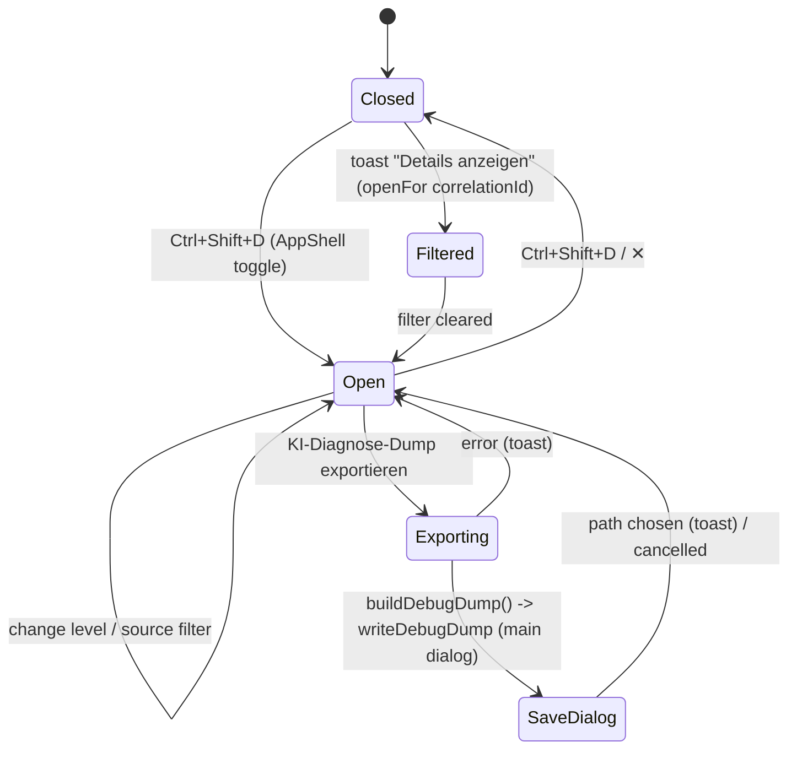
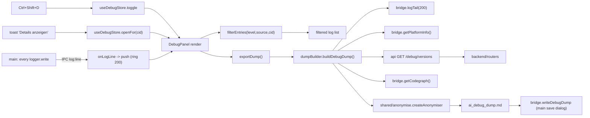

# UI Feature — Debug console (Ctrl+Shift+D)

Product language: **de** labels. Scope: the in-app developer panel (Section 6) — a live, filterable log stream fed from the main process, and a "KI-Diagnose-Dump exportieren" action that writes an anonymised, ready-to-paste LLM prompt. The renderer never reads the log file; main is the sole writer and pushes lines over the `contextBridge`.

## Screen / state diagram

`init()` runs once on shell mount: subscribe to `log:line` + prime with `logTail(200)`.

## UI-to-function graph

## Action table

| Action ID | Screen and visible label | Event and enabled condition | Handler / route / command source | Service or effect source | Pending, success, error, cancel behavior | Acceptance evidence |
|---|---|---|---|---|---|---|
| `D_OPEN_TOGGLE` | anywhere — `Strg+Umschalt+D` | always | `AppShell` keydown → `useDebugStore.toggle` [`AppShell.tsx`](../../src/renderer/components/AppShell.tsx) / [`useDebugStore.ts`](../../src/renderer/store/useDebugStore.ts) | opens/closes bottom panel | — | `tests/renderer/useDebugStore.test.ts` (filter logic); key binding compiled |
| `D_TOAST_DETAILS` | toast — „Details anzeigen" | on an error toast | `notifyError` → `useDebugStore.openFor(cid)` [`useAppStore.ts`](../../src/renderer/store/useAppStore.ts) | opens panel pre-filtered to `correlationId`, level=error | — | filter precedence tested (`filterEntries` cid branch) |
| `D_FILTER_LEVEL` / `D_FILTER_SOURCE` | panel — Stufe / Quelle | while open | `setLevel`/`setSource` → `filterEntries` [`useDebugStore.ts`](../../src/renderer/store/useDebugStore.ts) | list re-derives via `useMemo` | — | `tests/renderer/useDebugStore.test.ts` |
| `D_EXPORT` | panel — „KI-Diagnose-Dump exportieren" (`Export`) | while open, not busy | `DebugPanel.exportDump` → `buildDebugDump` [`DebugPanel.tsx`](../../src/renderer/components/DebugPanel.tsx) / [`dumpBuilder.ts`](../../src/renderer/lib/dumpBuilder.ts) | `getPlatformInfo` + `GET /debug/versions` + `getCodegraph` + curated stores → anonymise → `writeDebugDump` (main dialog) | busy „Beschäftigt …"; writes file (atomic, 0600); cancel → no toast; error → toast | `tests/shared/anonymise.test.ts` (path/name redaction) |
| system `S_LOG_STREAM` | — | every `logger.write` (main/renderer/backend) | `initLogger(onWrite)` → `webContents.send(LOG_LINE)` [`logger.ts`](../../src/main/logger.ts) | renderer `push` (ring 200) | a dead receiver can never break logging (`try/catch`) | single-writer preserved (no second file write) |

## Verified source symbols

- `initLogger(onWrite)`, `readTail` — [`src/main/logger.ts`](../../src/main/logger.ts)
- `useDebugStore` (`toggle/openFor/push/setLevel/setSource`), `filterEntries` — [`src/renderer/store/useDebugStore.ts`](../../src/renderer/store/useDebugStore.ts)
- `buildDebugDump`, `formatLogLines` — [`src/renderer/lib/dumpBuilder.ts`](../../src/renderer/lib/dumpBuilder.ts)
- `createAnonymiser` — [`src/shared/anonymise.ts`](../../src/shared/anonymise.ts)
- IPC `LOG_LINE`/`LOG_TAIL`/`DEBUG_DUMP_WRITE`/`CODEGRAPH_READ` — [`src/shared/ipc.ts`](../../src/shared/ipc.ts)

## Validation notes

- **Single-writer (Section 6):** the file is written only by main's `electron-log` transport; the live mirror is an in-memory `webContents.send`, never a second destination. `readTail` reads the same file (main-only) and skips malformed lines from rotation/crash.
- **Anonymisation & secrets:** every path/filename becomes a stable `<PFAD-n>`/`<DATEI-n>` token; the mapping never leaves the process. The dump omits API keys entirely, reduces `baseUrl` to protocol+host (`originOnly`), and reads a *curated* app state (no `originalPath`, no passwords, no certificate data). `GET /debug/versions` checks Docling with `importlib.util.find_spec` — never `import docling` (Section 5.3).
- Backend contract verified against `backend/routers.py`: `GET /debug/versions → {python, protocolVersion, libraries, doclingAvailable}`, token-guarded (401 without `X-Auth-Token`) — `backend/tests/test_core.py`.
- Automated: `vitest` **105** (anonymise ×5, filterEntries ×4 added); `tsc` node+web clean; `electron-vite build` OK; backend **79** (+2).
- **Scope note:** the panel's live rendering and the physical save-to-disk are exercised end-to-end against the running app in Step 12 (Playwright); here the pure units (redaction, filtering) and full type/build coverage are green. No API key, password, or path is emitted by the dump.
