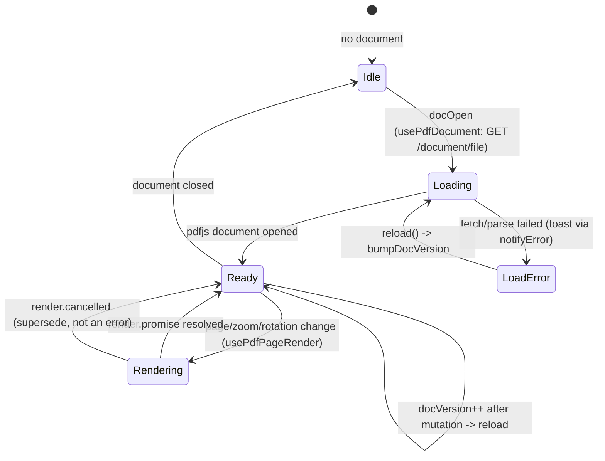

# UI Feature — Rendering engine & interaction overlay

Product language: **de** for any visible label (`src/renderer/locales/de.json`). Instruction prose in English. Scope: the reusable pdfjs engine (main canvas + virtualised thumbnails) and the single shared interaction overlay introduced in Step 8. Consumers (signature placement, redaction, VLM box, sidebar tabs) arrive in Step 9/10 and reuse these exact components.

## Screen / state diagram



Rendering cancellation is drawn as a normal path back to Ready, **not** as an error — a superseded render task is expected, not a failure.

## UI-to-function graph

```mermaid
flowchart LR
    BOOT["App boot (Step 9 mounts engine)"] --> UDOC["usePdfDocument()"]
    UDOC -->|GET /document/file (bytes)| AC["api.getBytes() -> apiClient"]
    AC --> ODB["openDocumentFromBytes() -> pdfjs.getDocument({data})"]
    ODB --> DOC[(PDFDocumentProxy)]
    DOC --> UPR["usePdfPageRender()"]
    UPR -->|page.getViewport{scale,rotation}| VP["PageViewport"]
    UPR -->|page.render({canvasContext,viewport,transform:[dpr..]})| CANVAS["<canvas>"]
    VP -->|returned to consumer| OV["InteractionOverlay"]
    A_RECT["A_RECT: drag select box"] --> OV
    OV -->|viewport.convertToPdfPoint| RECT["rectFromCorners()/toPdfFromViewport()"]
    RECT -->|PdfRect bottom-left| OUT["onRect(rect) -> consumer (signatur/redaction/VLM)"]
    DOC --> TLIST["ThumbnailList()"]
    TLIST -->|thumbnailWindow(scroll,view,stride)| WIN["visible index window"]
    WIN --> TTILE["ThumbnailTile() -> page.render(fit)"]
    A_THUMBSEL["A_THUMB_SELECT: click page"] --> TTILE
```

## Action table

| Action ID | Screen and visible label | Event and enabled condition | Handler / route / command source | Service or effect source | Pending, success, error, cancel behavior | Acceptance evidence |
|---|---|---|---|---|---|---|
| `A_RECT` | Page — drag selection box (select‑rect tool) | `pointerdown/move/up` on overlay root, only when `activeTool='select-rect'` and a viewport is present | `InteractionOverlay` pointer handlers → `onRect` prop in [`src/renderer/components/InteractionOverlay.tsx`](../../src/renderer/components/InteractionOverlay.tsx) | `rectFromCorners`+`toPdfFromViewport` (`viewport.convertToPdfPoint`) → `PdfRect` [`src/renderer/lib/overlayMath.ts`](../../src/renderer/lib/overlayMath.ts) | live rubber‑band; on pointer‑up emits one PDF‑space rect; `Esc` cancels tool | `tests/renderer/InteractionOverlay.test.tsx` (emits `{x,y,width,height}`; none when tool off; Esc cancels) |
| `A_THUMB_SELECT` | Sidebar thumbnails — page tile | `onClick` while a document is open | `ThumbnailTile` → `onSelect(index)` in [`src/renderer/components/ThumbnailList.tsx`](../../src/renderer/components/ThumbnailList.tsx) | parent selection (store `currentPage` wired in Step 9) | only visible window tiles mount/render | `tests/renderer/thumbnailWindow.test.ts` (window math incl. overscan/clamp/empty) |
| system `S_DOC_LOAD` | main canvas | `docOpen` + `docVersion` change | `usePdfDocument()` [`src/renderer/hooks/usePdfDocument.ts`](../../src/renderer/hooks/usePdfDocument.ts) | `api.getBytes('/document/file')` → `openDocumentFromBytes` [`src/renderer/lib/pdfjs.ts`](../../src/renderer/lib/pdfjs.ts) | loading → ready; previous doc destroyed; error → `notifyError` toast | backend bytes contract tested in `tests`/`test_core.py` (`/document/file`) |
| system `S_PAGE_RENDER` | a single page canvas | page/zoom/rotation/dpr change | `usePdfPageRender()` [`src/renderer/hooks/usePdfPageRender.ts`](../../src/renderer/hooks/usePdfPageRender.ts) | `page.render({canvasContext,viewport,transform:[dpr,0,0,dpr,0,0]})` | prior task `.cancel()` on re-run; `RenderingCancelledException` swallowed | build + type verified; runtime rasterization deferred to Step 12 Playwright |
| system `S_COORD_CONTRACT` | any placement sent to backend | every rect/point handed to backend | `canvasRectToPdf` [`src/renderer/lib/pdfCoords.ts`](../../src/renderer/lib/pdfCoords.ts) | PDF user space (bottom‑left, points) — backend does no conversion | deterministic, finite | `tests/renderer/pdfCoords.test.ts` (Step 4) + `tests/renderer/overlayMath.test.ts` (overlay == tested conversion) |

## Verified source symbols

- `usePdfDocument`, `usePdfPageRender` — [`src/renderer/hooks/`](../../src/renderer/hooks/)
- `PageCanvas`, `InteractionOverlay`, `ThumbnailList` — [`src/renderer/components/`](../../src/renderer/components/)
- `openDocumentFromBytes` (worker via `?url`), `pdfjs.GlobalWorkerOptions.workerSrc` — [`src/renderer/lib/pdfjs.ts`](../../src/renderer/lib/pdfjs.ts)
- `rectFromCorners`, `toPdfFromViewport` (public seam `convertToPdfPoint`) — [`src/renderer/lib/overlayMath.ts`](../../src/renderer/lib/overlayMath.ts)
- `thumbnailWindow` — [`src/renderer/lib/thumbnailWindow.ts`](../../src/renderer/lib/thumbnailWindow.ts)

## Validation notes

- pdfjs **4.10.38** API verified against the **installed** package types: `getDocument({data,isEvalSupported})`, `page.getViewport({scale,rotation})`, `page.render({canvasContext,viewport,transform})`, `RenderTask.promise`/`.cancel()`, `PageViewport.convertToPdfPoint/convertToViewportPoint`, `GlobalWorkerOptions.workerSrc` setter.
- Worker is bundled locally (no CDN): the build emits `out/renderer/assets/pdf.worker.min-<hash>.mjs` and `workerSrc` points at it (verified by forcing the engine into the graph). CSP `worker-src`/`connect-src` must allow the local origin (Step 1 baseline).
- Automated: `vitest` (74 total) — overlay tool state, thumbnail windowing, overlay‑rect == tested `pdfCoords` conversion.
- **Limitation (honest):** jsdom cannot rasterize pdfjs canvases, so actual pixel rendering of `usePdfPageRender`/`ThumbnailTile` is validated only by **build + type‑check** here; end‑to‑end rasterization is exercised by the **Step 12 Playwright** smoke against the running app. The interaction overlay and coordinate math are covered without a canvas by the tests above. Hover actions / drag‑to‑reorder on thumbnails are wired in Step 9 (the tiles and windowing already exist).
