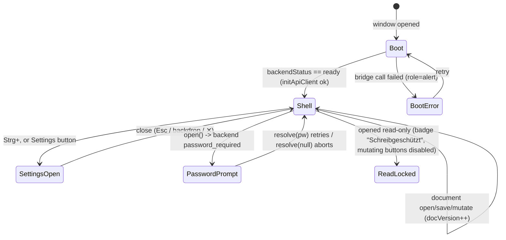

# UI Feature — App shell (top bar, sidebar tabs, settings, modals)

Product language: **de** labels (`src/renderer/locales/de.json`), instruction prose English. Scope: the Step 9 shell — top navigation toolbar, five sidebar tabs, settings modal, password modal, global undo/redo shortcuts, Ctrl+wheel zoom, drag‑free thumbnail selection. Mounts the Step 8 engine (`PageCanvas`, `ThumbnailList`).

## Screen / state diagram



Read‑only is drawn as a self‑state because it is a persistent constraint on the same shell, not a separate screen.

## UI-to-function graph

```mermaid
flowchart LR
    OPEN["TopBar: Öffnen"] -->|openPdfDialog IPC| DLG["main dialog.showOpenDialog"]
    DLG -->|path|null| OPEN
    OPEN --> OPENDOC["openDocument() -> lib/documents"]
    OPENDOC -->|POST /document/open| BE["backend/routers"]
    OPENDOC --> ST[("zustand AppStore + docVersion++")]
    ST --> ENGINE["usePdfDocument -> usePdfPageRender -> PageCanvas"]
    ST --> THUMBS["ThumbnailList (virtualized)"]
    THUMBS -->|onSelect| ST
    META["Sidebar Tab2 MetadataPanel"] -->|GET/POST /document/metadata| BE
    META --> DOC["setMetadata() -> documents"]
    ZOOM["TopBar zoom / Ctrl+wheel"] --> UI[("useUiStore.zoom")]
    UI --> ENGINE
    UNDO["TopBar Undo / Strg+Z"] --> PERFORM["performUndo()"]
    PERFORM -->|POST /document/undo| BE
    SETTINGS["Settings button / Strg+,"] --> SETM["SettingsModal"]
```

## Action table

| Action ID | Screen and visible label | Event and enabled condition | Handler / route / command source | Service or effect source | Pending, success, error, cancel behavior | Acceptance evidence |
|---|---|---|---|---|---|---|
| `A_OPEN` | TopBar — „Öffnen" (`FolderOpen`) | click, enabled while not busy | `TopBar.onOpen` → `window.pdfEditor.openPdfDialog` → `openDocument()` [`TopBar.tsx`](../../src/renderer/components/TopBar.tsx) / [`documents.ts`](../../src/renderer/lib/documents.ts) | IPC `dialog:open-pdf` → `POST /document/open` | busy label „Öffnet …"; success sets pageCount + history reset; error → toast; dialog cancel = no‑op | `tests/renderer/documents.test.ts` (openDocument sets pageCount), `App.test.tsx` (Open button present when ready) |
| `A_SAVE` | TopBar — „Speichern" (`Save`) | click, `docOpen && !readOnly && !mutationLock` | `TopBar.onSave` → `saveDocument(false)` [`documents.ts`](../../src/renderer/lib/documents.ts) | `POST /document/save`; `write_denied` → auto „Speichern unter" via `dialog:save-pdf` | busy; success → success toast; error → toast | `documents.test.ts` mutation/error patterns |
| `A_UNDO` / `A_REDO` | TopBar + global `Strg+Z` / `Strg+Umschalt+Z` | enabled `canUndo`/`canRedo` and not locked | `performUndo/performRedo` [`useAppStore.ts`](../../src/renderer/store/useAppStore.ts), bound in [`AppShell.tsx`](../../src/renderer/components/AppShell.tsx) | `POST /document/undo` `/redo` | moves command metadata between stacks, `docVersion++` | `store.test.ts` (undo/redo stack moves) |
| `A_PAGE_GOTO` | TopBar pagination input | `Enter`/blur; invalid clamps + red flash | `TopBar.commitPage` → `setCurrentPage` | `clampPage()` (pure) | clamps to range, `pageFlash` red border | `tests/renderer/uiStore.test.ts` (clampPage) |
| `A_ZOOM` | TopBar zoom presets + `Strg`+wheel | always | `useUiStore.zoomIn/zoomOut/setZoom` + wheel in `AppShell` | `clampZoom`/`stepZoom` (10 %–800 %) | continuous, bounded | `tests/renderer/uiStore.test.ts` |
| `A_TAB` | Sidebar 5 tabs (`Layers/Info/PenTool/ShieldCheck/Sparkles`) | click | `setActiveTab` [`useUiStore.ts`](../../src/renderer/store/useUiStore.ts) | renders the tab panel | — | present in `App.test` shell render |
| `A_META_SAVE` | Tab2 — „Metadaten speichern" | `docOpen && !readOnly && !busy` | `MetadataPanel` → `setMetadata()` | `POST /document/metadata` | busy; success toast „Metadaten gespeichert."; error toast | `documents.test.ts` (setMetadata posts + success toast) |
| `A_APPEND` | Tab1 — „PDF anhängen" (`Plus`) | `docOpen && !readOnly` | `Sidebar.onAppend` → `openPdfDialog` → `mergePdf()` | `POST /pages/merge` | busy; command metadata MERGE_PDF | `documents.test.ts` merge command path |
| `A_PASSWORD` | Password modal | backend `password_required` | `PasswordModal` → `resolvePassword` [`PasswordModal.tsx`](../../src/renderer/components/PasswordModal.tsx) | retries `openDocument` up to 3 | cancel clears the field immediately | wired in `documents.openDocument` attempt loop |

## Verified source symbols

- `AppShell`, `TopBar`, `Sidebar`, `SettingsModal`, `PasswordModal`, `MetadataPanel` — [`src/renderer/components/`](../../src/renderer/components/)
- `openDocument/saveDocument/rotatePage/deletePage/reorderPages/mergePdf/setMetadata` — [`src/renderer/lib/documents.ts`](../../src/renderer/lib/documents.ts)
- `useUiStore` (`clampZoom/clampPage/stepZoom`), `useAppStore` — [`src/renderer/store/`](../../src/renderer/store/)
- `usePageSize` — [`src/renderer/hooks/usePageSize.ts`](../../src/renderer/hooks/usePageSize.ts)
- Dialog IPC `openPdfDialog/savePdfDialog/pickCertDialog` — [`src/shared/ipc.ts`](../../src/shared/ipc.ts), [`src/preload/index.ts`](../../src/preload/index.ts), [`src/main/index.ts`](../../src/main/index.ts)

## Validation notes

- Zustand **v5 + immer** semantics re‑verified: every `set` uses a block body (a returned new value *and* a mutated draft throws) — same rule that bit Step 7; `useUiStore` follows it.
- Electron `dialog` API verified against the installed Electron 33 typings: `showOpenDialog(options)` / `showSaveDialog(options)` return `{canceled, filePaths, filePath}` — the parentless overload is used so no `BaseWindow` is required.
- Electron security unchanged: dialogs run in main; the renderer only ever receives a path string, never an `fs` handle.
- Automated: `vitest` **84** (App shell vs. bridge, documents action layer, zoom/pagination pure fns). `tsc` node+web clean; `electron-vite build` OK (the Step 8 engine now links naturally through `AppShell`, so the pdfjs worker asset emits without any forcing).
- **Not yet wired (later steps, by plan — not placeholders):** Print button present but disabled (native CUPS print lands with Step 12 packaging); „KI‑Vorschlag" and the AI/settings AI‑tab config, signature/certificate modals, and drag‑to‑reorder thumbnails arrive in Step 10. The buttons render in their correct disabled state with tooltips, matching Section 4's "no silent failure / visible affordance".
