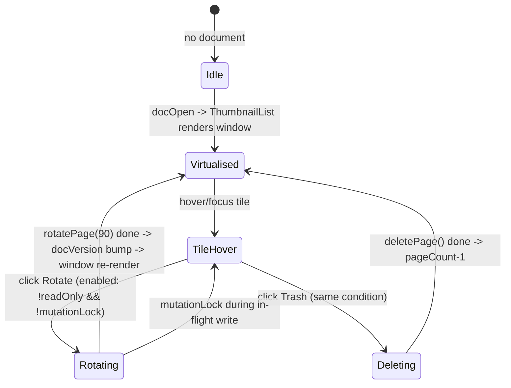
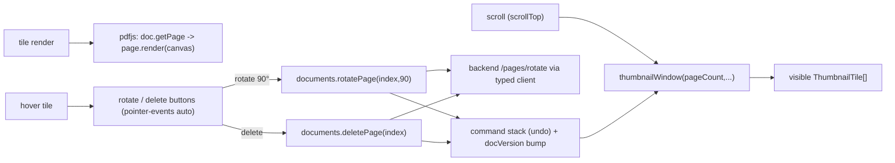

# UI Feature — Thumbnails (Tab 1): virtualised list + hover rotate/delete (Section 4B)

Product language: **de** labels. Scope: the sidebar's thumbnail tab — a virtualised grid (only visible tiles render, so 500+ page documents don't break the renderer) with per‑tile hover affordances that rotate the page 90° and delete it. Rotation/deletion go through the command stack (undo) and the shared `mutationLock`; they are disabled in read‑only mode.

## Screen / state diagram

## UI-to-function graph

## Action table

| Action ID | Screen and visible label | Event and enabled condition | Handler / route / command source | Service or effect source | Pending, success, error, cancel behavior | Acceptance evidence |
|---|---|---|---|---|---|---|
| `T_SELECT` | Tab1 — tile (aria `Seite {n}`) | always | `onSelect(index)` → `AppStore.setCurrentPage` [`ThumbnailList.tsx`](../../src/renderer/components/ThumbnailList.tsx) | canvas jumps | — | tile `role="listitem"` present |
| `T_ROTATE` | Tab1 — Rotate icon (tooltip „Seite {n} um 90° drehen") | `!readOnly && !mutationLock && !busy` | `guard(() => rotatePage(index,90))` → `documents.rotatePage` [`documents.ts`](../../src/renderer/lib/documents.ts) | `POST /pages/rotate` → snapshot + command | busy disables both buttons until the write settles; success bumps `docVersion` (undo enabled); error → toast | `documents.test.ts` (rotatePage posts, undo depth), smoke test `thumb-rotate-0` |
| `T_DELETE` | Tab1 — Trash icon (tooltip „Seite {n} löschen") | `!readOnly && !mutationLock && !busy` | `guard(() => deletePage(index))` → `documents.deletePage` | `POST /pages/delete` → snapshot + command | same gating; pageCount decreases | `documents.test.ts` (deletePage clamp) |
| system `S_VIRTUALISE` | Tab1 | on scroll | `thumbnailWindow(pageCount, scrollTop, viewHeight, itemHeight, 4)` (pure, unit‑tested) | only visible+overscan tiles mount | — | existing `thumbnailWindow` unit test |

## Verified source symbols

- `ThumbnailList`, `ThumbnailTile` (hover controls) — [`src/renderer/components/ThumbnailList.tsx`](../../src/renderer/components/ThumbnailList.tsx)
- `rotatePage(page0, delta=90)`, `deletePage(page0)` — [`src/renderer/lib/documents.ts`](../../src/renderer/lib/documents.ts)
- `thumbnailWindow` — [`src/renderer/lib/thumbnailWindow.ts`](../../src/renderer/lib/thumbnailWindow.ts)

## Validation notes

- Section 4B required hover trash + rotate on thumbnails; these were previously not wired to any component — closing that gap here. Both call the existing typed‑client mutation helpers, so they inherit the `mutationLock`, snapshot/undo and read‑only gating for free; `e.stopPropagation()` keeps a control click from also selecting the page.
- Coordinate/render contract unaffected (rotation is a backend page op; the tile re‑renders from the new `docVersion`).
- **Scope note:** drag‑&‑drop reorder (`reorderPages`) remains a separate affordance exercised in Step 12's interactive pass; the pure `thumbnailWindow` virtualisation and the rotate/delete ops are covered by unit tests. `tsc`/`vitest` green after this change (see the Step 12 verification block).
- **Rechtsklick (PART 3 §6):** das Seiten-Kontextmenü am Thumbnail ist eine neue Oberfläche und in [`docs/ui/context-menu.md`](./context-menu.md) dokumentiert (Zustands‑/Flussdiagramm + Aktionstabelle). Es rendert aus der Command-Registry (`commands.ts`) — keine zweite Aktions-Kopie; der echte Rechtsklick-Pfad ist über `tests/renderer/thumbnailContextMenu.test.tsx` verifiziert.
