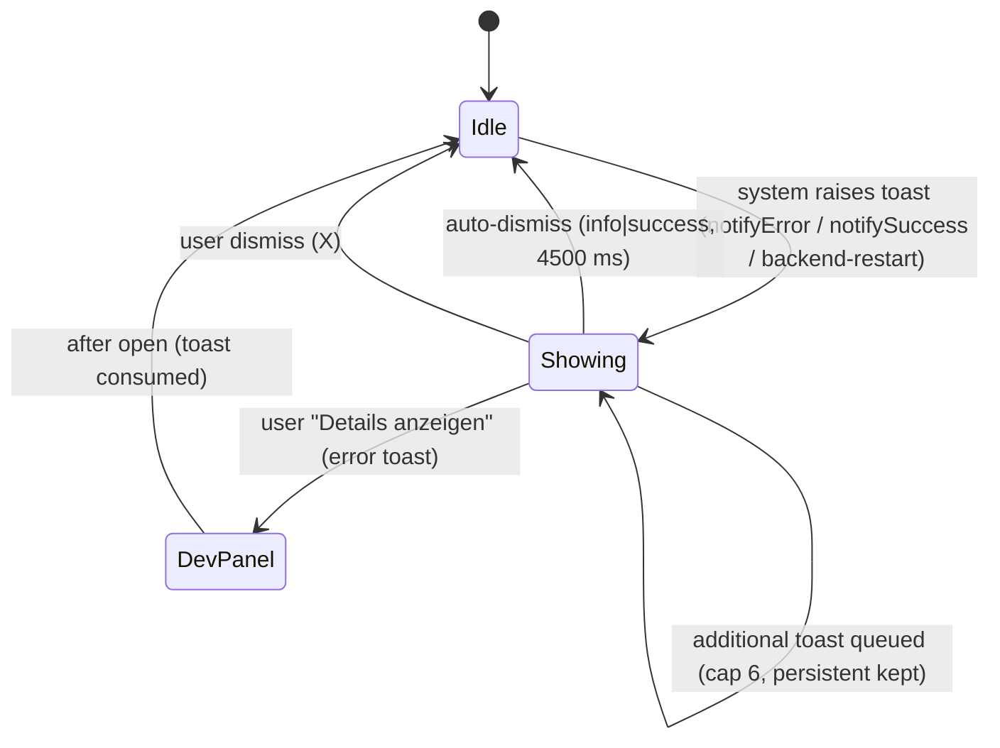

# UI Feature — Toasts (feedback surface)

Product language: **de** (reference strings in `src/renderer/locales/de.json`). Instruction prose in English per the diagram contract.

Scope: the toast feedback surface introduced in Step 7 (Section 4C — no silent failures). Later steps (9/10/11) add callers (rotate/save/AI/dev‑panel) that feed this same surface; the controls documented here are the toast controls themselves plus the two system triggers that already exist.

## Screen / state diagram



Transitions distinguish user actions (dismiss, details) from system events (auto‑dismiss, queue). No operation is falsely shown as success: an error toast is only raised from a confirmed `ApiError`/exception via `notifyError`.

## UI-to-function graph

```mermaid
flowchart LR
    T_ERR["ApiError from apiClient.request()"] --> notifyError()
    CRASH["backend status -> crashed / restartCount++"] --> addToast()
    notifyError() --> AT["useAppStore.addToast(error, correlationId, details)"]
    addToast() --> AT
    AT --> V[(zustand store: toasts[])]
    V --> TVP["ToastViewport()"]
    TVP --> CARD["ToastCard()"]
    A_TOAST_DISMISS["A_TOAST_DISMISS: X"] --> DT["useAppStore.dismissToast(id)"]
    A_TOAST_DETAILS["A_TOAST_DETAILS: Details anzeigen"] --> OPEN["onShowDetails(correlationId) -> dev panel (Step 11)"]
    DT --> V
    OPEN --> V
```

## Action table

| Action ID | Screen and visible label | Event and enabled condition | Handler / route / command source | Service or effect source | Pending, success, error, cancel behavior | Acceptance evidence |
|---|---|---|---|---|---|---|
| `A_TOAST_DISMISS` | Any toast — “Meldung schließen” (icon `X`) | `onClick`, always enabled while a toast is shown | `ToastCard` dismiss button → `useAppStore.dismissToast` in [`src/renderer/store/useAppStore.ts`](../../src/renderer/store/useAppStore.ts) | zustand `toasts[]` filtered | Removes the toast immediately; `aria-label` accessible name | `tests/renderer/Toast.test.tsx` → “entfernt einen Toast ueber den Dismiss-Button” |
| `A_TOAST_DETAILS` | Error toast — “Details anzeigen” | rendered only when `actionLabel` or `correlationId` present | `ToastCard` details button → `onShowDetails(correlationId)` prop (wired to dev panel in Step 11) | dev panel pre-filter (Step 11); consumes toast | Opens developer panel scoped to the `correlationId`; dismisses toast | `tests/renderer/Toast.test.tsx` renders `corr-42` on the error toast; panel wiring is a documented Step 11 boundary |
| system `S_TOAST_ERROR` | bottom-right error toast | raised on every rejected backend call | `notifyError()` in [`src/renderer/store/useAppStore.ts`](../../src/renderer/store/useAppStore.ts) | `useAppStore.addToast(kind:'error')` via [`src/renderer/lib/apiClient.ts`](../../src/renderer/lib/apiClient.ts) `ApiError` | Persistent (no auto-dismiss), shows prefix + message + `correlationId` | `tests/renderer/store.test.ts` → “notifyError aus ApiError wird Fehler-Toast”; `apiClient.test.ts` maps error body |
| system `S_TOAST_CAP` | queue cap | on every `addToast` | `useAppStore.addToast` | evicts oldest **non‑persistent** when > 6 | Error/backend-restart toasts are never evicted | `tests/renderer/store.test.ts` → “begrenzt fluechtige Toasts, persistent bleiben erhalten” |
| system `S_TOAST_CRASH` | “Backend neu gestartet” (persistent) | backend restart (`restartCount++`) | `setBackendStatus` consumer (App boot in [`src/renderer/App.tsx`](../../src/renderer/App.tsx)) | `addToast(persistent)` | Persistent until dismissed; second crash opens modal (Section 2) | Section 2 requirement; App status wiring covered by `tests/renderer/App.test.tsx`; the dedicated restart modal arrives with the crash UI (Step 9/11) |

## Verified source symbols

- `useAppStore` (store + actions `addToast`/`dismissToast`) — [`src/renderer/store/useAppStore.ts`](../../src/renderer/store/useAppStore.ts)
- `notifyError` / `notifySuccess` — same module
- `ToastViewport`, `ToastCard` — [`src/renderer/components/Toast.tsx`](../../src/renderer/components/Toast.tsx)
- `ApiError` (carries `code`/`correlationId`/`status`) — [`src/renderer/lib/apiClient.ts`](../../src/renderer/lib/apiClient.ts)

## Validation notes

- Automated: `tests/renderer/Toast.test.tsx` (3), `store.test.ts` (7), `apiClient.test.ts` (8) — green under `vitest` (jsdom).
- Accessibility: viewport carries `aria-live="polite"`; error card `role="alert"`, info/success `role="status"`; icon controls have `aria-label`s; dismiss + details are keyboard-focusable buttons with `focus-visible` outlines.
- **Limitation:** Mermaid source is editable but **not rendered** here (no Mermaid renderer verified in this checkout). `onShowDetails` → developer panel is a real seam declared now and **implemented in Step 11**; until then the details button dismisses without opening a panel — this is the only not-yet-connected edge and is called out rather than faked.
